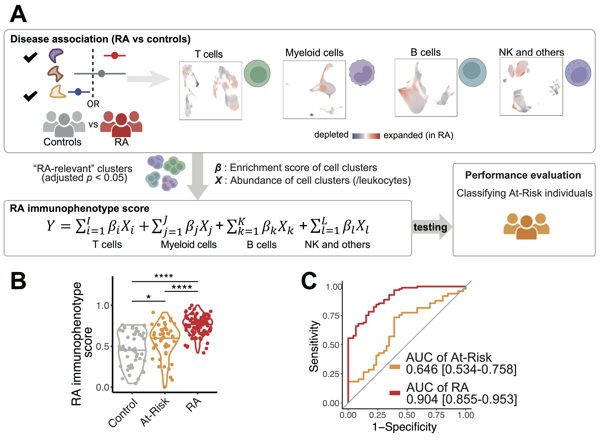

# Deep immunophenotyping reveals circulating activated lymphocytes in individuals at risk for rheumatoid arthritis

Rheumatoid arthritis (RA) is a systemic autoimmune disease with currently no effective prevention strategies. Identifying pathogenic immune phenotypes in ‘At-Risk’ populations prior to clinical disease is crucial to establishing prevention strategies. Here, we applied mass cytometry to deeply characterize the immunophenotypes in blood from At-Risk individuals based on the presence of antibodies to citrullinated protein antigens (ACPA) and/or first-degree relative (FDR) status (n=52), established RA (n=67), and healthy controls (n=48). We quantified and uncovered significant cell expansions in At-Risk individuals compared with controls, including CCR2+CD4+ T cells, T peripheral helper cells (Tph), type 1 T helper cells, and CXCR5+CD8+ T cells. We also found that CD15+ classical monocytes were especially expanded in ACPA-negative At-Risk individuals who had FDR, and an activated PAX5low naïve B cell population expanded in ACPA-positive individuals who also had an FDR with RA. Further, we developed a “RA immunophenotype score” classification method based on the degree of enrichment and abundance of cell states relevant to established RA. We demonstrated this score significantly distinguished At-Risk individuals from controls. In all, we systematically identified activated lymphocyte phenotypes in At-Risk individuals, along with immunophenotypical differences among ACPA+ and FDR At-Risk subpopulations. Our classification model may provide a promising approach for understanding RA pathogenesis with the goal to develop preventive strategies and novel therapeutic targets. 

**Reference: Inamo J et al. Deep immunophenotyping reveals circulating activated lymphocytes in individuals at risk for rheumatoid arthritis. ([preprint](https://XXX))**

# Overview of mass cytometry analytical strategy, clustering, and classifications in our study.

We deeply characterized the immunophenotypes in blood of At-Risk individuals, established RA, and relevant controls enrolled from the SERA (Studies of the Etiologies of Rheumatoid Arthritis) and the AMP RA/SLE (Accelerating Medicines Partnership Rheumatoid Arthritis/Systemic Lupus Erythematosus).

# Motivation for this study
- No effective prevention strategies for RA currently.
- Delay in the diagnosis and treatments is associated with poor functional prognosis.
- Current RA disease development research is mainly based on clinical observations with relatively low-resolution measurements.
- To further develop accurate prediction models for future RA, investigating the full molecular and cellular spectrum in individuals who are in the At-Risk state is the key to identifying predictive markers and phenotypes to further develop accurate prediction models for future RA, and identify targets for preventive interventions.

# Highlights
- We identified immune cell phenotypes relevant to the preclinical phase of RA
- We developed "RA immunophenotype score" schema to estimate the degree of RA-relevant immunophenotypes for individuals
- We provide large-scale reference dataset for single-cell proteomics analysis

# Results summary

**Identifications of specific T cell populations that were associated with At-Risk. A.** Cells in UMAP are colored in red (expansion) or blue (depletion) and p-value is shown as well. **B.** Distributions of cell neighborhood correlations and odds ratio. Error bars represent 95% confidence intervals. 

**Classifications for At-Risk individuals and established RA individuals. A**. RA immunophenotype score utilizing RA-specific cell type abundances to quantify and distinguish At-Risk individuals from control. For each cell type, all p-values from the covarying neighborhood analysis test were p = 1e-3. We incorporated clusters that are significantly associated with RA (adjusted p < 0.05) to model the RA immunophenotype score. We calculated RA immunophenotype score based on cell type abundances multiplied by corresponding major cell type proportions and enrichment scores for each cell type, **B.** Distribution of RA immunophenotype score across individual samples from RA, At-Risk, and controls; **** p < 0.0001, * p < 0.05, **C.** Receiver operating characteristic (ROC) analysis to evaluate the classification performance of RA immunophenotype score in distinguishing At-Risk from control. Areas under the curve (AUC) with 95% confidence intervals were described. All the analyses are adjusted for age and sex.