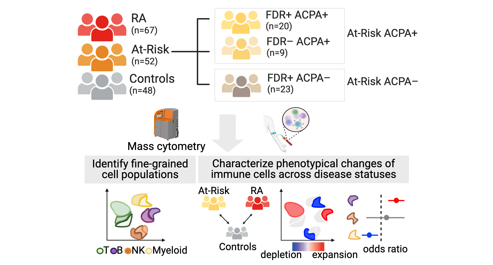

# Deep immunophenotyping reveals circulating activated lymphocytes in individuals at risk for rheumatoid arthritis 

Rheumatoid arthritis (RA) is a systemic autoimmune disease with no universally effective prevention strategies. Identifying pathogenic immune phenotypes in ‘At-Risk’ populations prior to disease onset is crucial to establishing prevention strategies. We deeply characterized the immunophenotypes in blood from At-Risk individuals (the presence of serum antibodies to citrullinated protein antigens (ACPA) and/or first-degree relative (FDR) status) as compared to established RA and healthy controls enrolled from the AMP RA/SLE (Accelerating Medicines Partnership Rheumatoid Arthritis/Systemic Lupus Erythematosus) Network. 

This Github Repo includes the source code for the computational analyses involved in this work.

# Overview

**Overview of our analytical strategy**: including 1) integrative clustering, 2) co-varying neighborhood analysis-based disease association, and 3) classification modeling.

&nbsp;&nbsp;

# Summary of results

**We systematically identified activated lymphocyte phenotypes in At-Risk individuals, along with immunophenotypic differences between different At-Risk subpopulations**.

- We identified significant cell expansions in At-Risk individuals compared with controls, including CCR2+CD4+ T cells, T peripheral helper (Tph) cells, type 1 T helper cells, and CXCR5+CD8+ T cells.
  
- We also found that CD15+ classical monocytes were specifically expanded in ACPA-negative FDRs, and an activated PAX5low naïve B cell population was expanded in ACPA-positive FDRs. 

<kbd>

</kbd>

&nbsp;&nbsp;

**We developed an “RA immunophenotype score” classification method based on the degree of enrichment of cell states relevant to established RA patients**. 

- This score significantly distinguished At-Risk individuals from controls, providing a promising approach for understanding RA pathogenesis with the goal to develop effective prevention strategies. 

<kbd>

</kbd>

# Citation 

Inamo J, *et al*. Deep immunophenotyping reveals circulating activated lymphocytes in individuals at risk for rheumatoid arthritis. ([preprint](https://XXX))

# Contact us
Please contact us (Jun Inamo: JUN.INAMO@CUANSCHUTZ.EDU) with any questions or comments.

The data presented here comes from the laboratory of [Dr. Fan Zhang](https://fanzhanglab.org/) through collaborating with [AMP RA/SLE Network](https://www.niams.nih.gov/grants-funding/funded-research/accelerating-medicines/RA-SLE).
