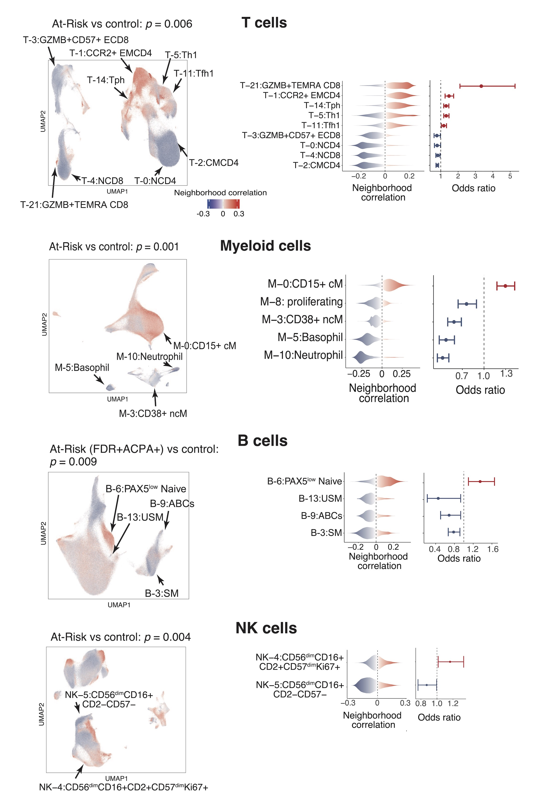

# Deep immunophenotyping reveals circulating activated lymphocytes in individuals at risk for rheumatoid arthritis

Rheumatoid arthritis (RA) is a systemic autoimmune disease with currently no effective prevention strategies. Identifying pathogenic immune phenotypes in ‘At-Risk’ populations prior to clinical disease is crucial to establishing prevention strategies. Here, we applied mass cytometry to deeply characterize the immunophenotypes in blood from At-Risk individuals of clinical subpopulations based on family history and autoantibody status (n=52), established RA (n=67), and healthy controls (n=48). Through integrative and disease association analyses, we uncovered significant cell expansions in At-Risk individuals compared with controls, including CCR2+ T helper cells, T peripheral helper cells, Type 1 T helper cells, CXCR5+CD8+ T cells. We further validated the At-Risk associations of T cell phenotypes using our validation cohort with 57 At-Risk and 23 healthy individuals. In addition, we found that CD15+ classical monocytes were especially expanded in ACPA-negative At-Risk, and an activated PAX5low naïve B cell population expanded in ACPA-positive individuals who also had an FDR with RA. Moreover, we developed a “RA immunophenotype score” classification method based on the degree of enrichment and abundance of cell states relevant to established RA using mixed effect modeling and logistic regression, and demonstrated that this score significantly distinguished At-Risk individuals from the control (p=0.039 and AUC>0.6). In all, we systematically characterized immunophenotypical differences among At-Risk subpopulations and their abundance comparing with established RA using single-cell proteomics; Further, our classification model may provide a promising approach towards uncovering the unknown pathogenesis of RA with the goal to develop preventive strategies.

**Reference: Inamo J et al. Deep immunophenotyping reveals circulating activated lymphocytes in individuals at risk for rheumatoid arthritis. ([preprint](https://XXX))**

# Study design

# Highlights
- We identified immune cell phenotypes relevant to the preclinical phase of RA
- We developed "RA immunophenotype score" schema to estimate the degree of RA-relevant immunophenotypes for individuals
- We provide large-scale reference dataset for single-cell proteomics analysis

# Results summary

